# 🌍 GitWorld Engine

> **A GitHub Action that turns your contribution graph into an animated city — visible right on your GitHub profile.**

Like the snake game, but instead of a snake eating your contributions, your commits **build a living, breathing world.**



---

## How it Works

A GitHub Action runs daily, fetches your public GitHub data, and generates an animated SVG that lives in your profile README.

### The World Mapping

| GitHub | World |
|--------|-------|
| 🏙️ Repo | City |
| 🏗️ Commit | Building (height = commit count) |
| ⭐ Stars | Tempo (animation speed) |
| 🐛 Issue | Monster (roams the streets) |
| 🔀 Pull Request | Boss (crown on building) |
| 💻 Language | Biome & color theme |
| 🏢 Organization | Kingdom border |
| 👥 Followers | Road density |
| 🔥 Streak | Smoke / fire effects |

### Biome Themes (auto-selected by top language)

| Language | Biome |
|---|---|
| JavaScript | Golden City Kingdom |
| TypeScript | Indigo Empire |
| Python | Emerald Forest |
| Go | Teal Ocean Realm |
| Rust | Red Wasteland |

---

## Setup (2 steps)

### Step 1 — Add the workflow to your profile repo

Copy [`profile-workflow.yml`](./profile-workflow.yml) to:
```
Dasmat13/Dasmat13/.github/workflows/gitworld.yml
```

### Step 2 — Add the SVG to your profile README

```markdown

```

That's it. The action runs daily and keeps your world updated.

---

## For Others to Use

```yaml
- uses: Dasmat13/git-world-action@main
  with:
    github_user_name: ${{ github.actor }}
    github_token: ${{ secrets.GITHUB_TOKEN }}
    svg_out_path: dist/gitworld.svg
```

---

## Local Development

```bash
git clone https://github.com/Dasmat13/git-world-action.git
cd git-world-action
npm install
npm run build        # compiles src/ → dist/index.js
```

---

## Inspiration

Inspired by [Platane/snk](https://github.com/Platane/snk) (the snake game) —
but instead of eating contributions, your commits **build a world**.

---

## License

MIT © [Dasmat13](https://github.com/Dasmat13)
